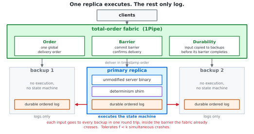
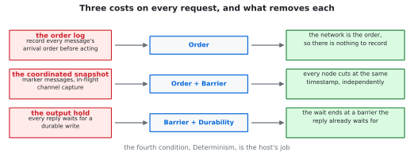
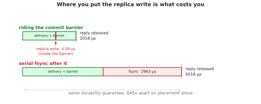
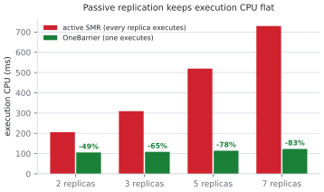

# OneBarrier

When a machine crashes, a fault-tolerant service keeps serving. Normally you get that by
writing the program for it: keep the state in a replicated database, or rebuild the
program on top of a framework that knows how to replay it. Either way, someone rewrites
the program.

OneBarrier rewrites nothing. You point it at a server binary you didn't write, and that
binary survives being killed. Stock redis, nginx, PostgreSQL. No patch, no rebuild, no
library to link, no kernel module. If a client got an answer back, that work isn't lost,
and nothing gets done twice.

[Paper](https://arxiv.org/abs/2608.14601) ·
[Site](https://01.me/research/OneBarrier) ·
[Getting started](docs/getting-started.md) ·
[How it works](docs/how-it-works.md) ·
[Your app](docs/your-app.md) ·
[Results](docs/research/RESULTS.md)

## The system

OneBarrier runs `k` copies of your service on a network with two unusual properties:
every machine receives messages in the same order, and the network tells you the moment
a message has definitely arrived. That moment is called a commit barrier.

<p align="center">
  <picture>
    <source media="(prefers-color-scheme: dark)" srcset="docs/figures/architecture-dark.svg">
    
  </picture>
</p>

One copy runs the program. The rest only write incoming requests to a log. Each request
also goes to those backups, and that copy happens *inside* the barrier the network was
going to cross anyway. So by the time the network confirms a request arrived, it is
already safely on other machines, and the reply was waiting for that same instant
regardless. Any `f` of the `k` machines can die at once.

When a machine dies, the network notices within tens of microseconds, drops it from the
group, and the survivors carry on in the same order as before. The dead one rejoins
later: load its last snapshot, replay the log it kept since then, and ask a survivor for
whatever it missed.

Because only one copy runs the program, ten machines cost about as much CPU as one, not
ten. That's the main reason to prefer this over running the program everywhere. It's
also why there's no automatic failover here: choosing a new leader needs consensus, and
that's left to a production layer. See [limitations](#limitations).

## Why this has been expensive for forty years

Transparent fault tolerance has been chased since the 1980s and has never reached
production. The obstacle was never checkpointing. It was three costs that every
transparent system paid on the critical path of every request:

**Writing down the order.** To replay requests you have to replay them in the order they
originally arrived. On a normal network that order is an accident of timing, so you have
to record it before acting on anything. That recording is the biggest cost in replay-based
systems.

**Taking a consistent snapshot.** Snapshot several machines at once and you can capture a
state that never really happened, like a message that was received but never sent.
Getting it right takes a round of coordination between the machines.

**Holding back replies.** Once you've told a client something you can't take it back. So
every reply waits until the state behind it is safely stored. Remus paid tens of
milliseconds on every single reply for this.

So industry went the other way and rewrote the applications. That's what Temporal, DBOS,
Restate, and Flink are for. It works, one program at a time. But rewriting every program
is the exact cost you were trying to avoid.

## Four conditions

The paper's argument is that these three costs have nothing to do with fault tolerance.
They're what you pay for running on a network that promises nothing. Four conditions make
them go away, and three of them are the network's job:

| condition | what the network promises |
|---|---|
| **Order** | every machine receives all messages in the same order, each stamped with a timestamp |
| **Barrier** | it tells you when everything up to timestamp `T` has arrived and nothing more can be lost |
| **Durability** | each message is copied to backup machines before that moment |

With Order, there's nothing to write down, because the network already knows the order.
With Order and Barrier, nobody has to coordinate a snapshot: every machine cuts at the
same timestamp, and at that instant no message is in flight. With Barrier and Durability,
holding replies costs nothing, because the wait ends at a moment the reply was waiting
for anyway.

<p align="center">
  <picture>
    <source media="(prefers-color-scheme: dark)" srcset="docs/figures/costs-dark.svg">
    
  </picture>
</p>

OneBarrier gets those three from [1Pipe](https://doi.org/10.1145/3452296.3472909), an
in-network total-order fabric with microsecond round trips.

The fourth condition, **Determinism**, is the host's job, and it's most of the code here.

## Determinism, the fourth condition

Replaying the requests only rebuilds the state if the program depends on nothing but
those requests. Real servers depend on more. They read the clock. They ask for random
numbers. They let the operating system decide which thread gets a lock first. None of
that is in a request log, so a plain replay gives you a server whose data matches and
whose timestamps, IDs, and everything derived from them don't.

Three `LD_PRELOAD` libraries close that, each usable on its own, on commodity hardware
with no fabric and no root:

| library | closes | how |
|---|---|---|
| `libobpreload.so` | time | a virtual clock that advances on input events, not on the wall clock |
| `librngdet.so` | randomness | a seccomp filter traps raw `getrandom(2)` and serves a fixed stream |
| `libdetsched.so` | threads | Kendo-style logical clocks make lock order deterministic |

The clock is the interesting one. The obvious fix is to write down every value the clock
returned and hand them back in the same order. That works until the program reads the
clock on its own internal timer instead of once per request, which redis and nginx both
do. The timer fires a different number of times during replay, so you hand back the wrong
value, and every value after that is wrong too. A virtual clock has no place to lose:
time is just `base + ticks`, and ticks only move when a request arrives, so it doesn't
matter who reads the clock or how often.

Threads are the ugly case, and the measurement changed my recommendation. Forcing
deterministic lock order costs over 1000x on a contended server. So don't do that. Run N
single-threaded instances instead, which are deterministic because there's only one
thread. That's also faster: 4 single-threaded memcached shards do 1.0 M ops/s against
821 k for one `memcached -t 4`, because shards don't fight over locks.

## Numbers

All reproduced by a command in [docs/research/RESULTS.md](docs/research/RESULTS.md).

**Replication rides the barrier.** The main result: where you put the replica write is
what costs you. Same durability, same guarantee, two placements:

| replica write | cost per request |
|---|---|
| inside the commit barrier | 4.59 µs (0.23% of delivery latency) |
| serial `fsync` after it | 2963 µs, and throughput collapses |

<p align="center">
  <picture>
    <source media="(prefers-color-scheme: dark)" srcset="docs/figures/barrier-dark.svg">
    
  </picture>
</p>

The gap between the two is measured on the real engine over a live network. How big it
gets at microsecond speeds comes from a calibrated model plus published 1Pipe numbers,
because there was no RDMA hardware to test on. It's the one major claim not measured on
real hardware.

**Passive costs 1x execution CPU, active costs Nx.** Only one replica executes:

| replicas | active SMR | OneBarrier (passive) | saved |
|---:|---:|---:|---:|
| 3 | 309.5 ms | 108.7 ms | 65% |
| 5 | 519.5 ms | 114.5 ms | 78% |
| 7 | 729.7 ms | 123.1 ms | 83% |

<p align="center">
  <picture>
    <source media="(prefers-color-scheme: dark)" srcset="docs/figures/passive-dark.svg">
    
  </picture>
</p>

**Correct under crash, on a live fabric.** Three replicas and two clients over the real
`ReliableHost` path converge to exactly the expected state with no order log. Kill a
replica mid-stream and the survivors still get there, while the dead one recovers what it
had saved and asks a survivor for the rest. Holds at 3, 5, 7, and 9 replicas. Crash
injection with real `kill -9` gives linearizable exactly-once histories, and the engine
protocols are model-checked in TLA+ (3.5M states, no violation).

**Fault tolerance is nearly free in throughput.** A fault-tolerant Redis-protocol server
against stock Redis with no persistence and no fault tolerance at all:

| | SET | GET | INCR |
|---|---:|---:|---:|
| Redis, not fault-tolerant | 239 234 | 244 499 | 238 095 |
| OneBarrier, fault-tolerant | 142 248 | 188 679 | 233 100 |
| | 59% | 77% | 98% |

**Recovery is linear in log length**, about 1.9 M requests/s, reconstructing the key set
exactly: 100 k requests in 87 ms, 1 M in 536 ms.

**Fifteen unmodified applications recover byte-identically**: redis, memcached, nginx,
Node.js, PostgreSQL, MariaDB, SQLite, Redis Streams, a Kafka partition model, Mosquitto,
dnsmasq, lighttpd, HAProxy, a Click network function, and a Python microservice. Each is
checked against a control run without OneBarrier that has to differ, so a pass isn't a
test that would have passed anyway. What survives unchanged: nginx's `Date:` header,
formatted deep inside nginx from its own cached clock; memcached's LRU eviction set, all
1416 survivors; Node's `Math.random()`; SQLite rows built from SQLite's own PRNG; a load
balancer's per-flow conntrack timestamps.

Interception overhead is under 5% for nginx under realistic load, p99 unchanged at 2 ms.
Time and RNG virtualization are within noise.

## Try it

The determinism layer runs on one machine, no fabric and no special hardware. That's
what the demo exercises: the shims plus record/replay recovery of one unmodified binary.
It isn't the replicated system, it's the part you can run on a laptop right now.

Linux, `gcc`, Rust 1.85+.

```bash
git clone https://github.com/19PINE-AI/OneBarrier.git
cd OneBarrier
make
make doctor    # tells you what else is worth installing
make demo      # kills an unmodified redis and brings its state back
make verify    # redis, memcached, nginx, node, each with a control
make test      # includes the multi-replica fabric tests
```

`make verify` records each server, kills it, waits out a real-time gap, replays, and
compares against a control run with no OneBarrier:

```
redis     live/replay 1782054868.424071 == 1782054868.424071  | control 1782054874.139431  OK
memcached live/replay STAT time 1782054875 == 1782054875      | control STAT time 1782054880  OK
nginx     live/replay Date 15:14:41 GMT == 15:14:41 GMT       | control Date 15:14:46 GMT  OK
node      live/replay {"now":1782054887981} == ...887981      | control {"now":1782054893724}  OK
```

The replicated engine is in `crates/onebarrier/`. `make test` runs it over a live
loopback-UDP fabric, including the convergence and replica-crash tests above.

## Limitations

**No automatic failover.** Recovery works and the network detects failures, but nothing
here chooses a new leader when the primary dies. That needs consensus and is left to a
production layer, so a primary crash means a window where the service is down. That
window is what the CPU savings cost you.

**No switch or RDMA hardware to test on.** The difference between riding the barrier and
stacking after it is measured on the real engine. How large it gets at microsecond speeds
comes from a calibrated model and published 1Pipe numbers. It's the one major claim not
measured on real hardware.

**Durability is in memory.** Copies live on other machines' memory, so the service
survives crashes but not a power cut that takes the whole rack down. Same tradeoff FaRM
and RAMCloud made, and it's what lets the replica write fit inside the barrier.

**Threads that share memory don't replay.** This works on servers where each process
keeps its own state and doesn't share it with other threads. A program whose threads share
mutable memory falls back to snapshotting the whole process with CRIU instead, which is
how PostgreSQL and MariaDB are covered here. The fit test is in
[docs/your-app.md](docs/your-app.md).

**Residual nondeterminism.** Two CPU instructions take no syscall and export no symbol:
`RDRAND`, pinned per-consumer here, and `RDTSC`, unused for externally visible state by
the fifteen applications. A fully general guarantee would trap both.

**There's a hard limit underneath all of this**, and it's an impossibility rather than an
engineering gap. If you've already sent something to an outside party who won't help you
detect duplicates, no system can un-send it. That's the two-generals problem. Holding
replies narrows the window, it can't close it. This works cleanest for services that talk
to other services inside the same network, interfaces that are safe to retry, and
self-contained leaf services.

This is a research prototype. It works, but it isn't a production service.

## Layout

| path | contents |
|---|---|
| `crates/onebarrier/` | the replicated engine: protocol, durable log, snapshots, recovery, benchmarks, checkers |
| `interpose/` | the determinism shims and the per-app harnesses |
| `bin/onebarrier` | the CLI |
| `spec/` | TLA+ specs for the engine and the fabric's total order |
| `docs/` | guides; `docs/research/` has the full experimental record |
| `paper/` | paper source and figures |
| `website/` | companion site |

## History

I wrote the first draft of this at Microsoft Research in 2017 and never finished it. The
idea was there, but the implementation and measurement it needed was more than I got
through on my own, and it sat as a draft for nine years.

I finished it in 2026 with LLMs doing most of the work: the code, the fifteen
application harnesses, the experiments, and much of the writing, directed by voice
([whisper coding](https://19pine.ai)) while I specified and reviewed.

## Citing

> Bojie Li. "OneBarrier: What a Network Must Provide for Transparent Fault Tolerance to
> Be Free." arXiv:2608.14601, 2026.

Metadata in [CITATION.cff](CITATION.cff).

## Contributing

See [CONTRIBUTING.md](CONTRIBUTING.md). The most useful thing you can add is a new
application harness. If you get something recovering byte-identically that isn't on the
list above, that's a real result.

## License

MIT or Apache-2.0, your choice.
