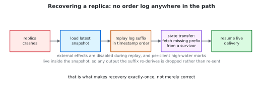
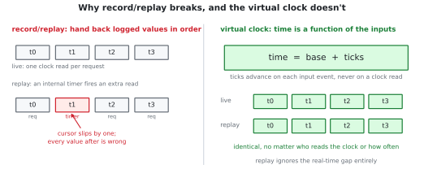
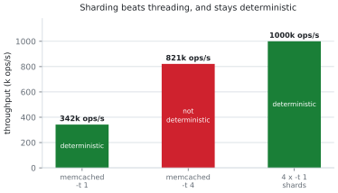

# How it works

The paper has the rigorous version. This is the short one.

## The three costs

To bring a dead process back you need to know what it was doing. Write down every
request, snapshot memory now and then, and after a crash restore the snapshot and
re-apply what came after. That's deterministic replay, and it's decades old.

It has three costs, and all three land on the critical path of a live request:

1. Writing down the order. Two clients send at the same time, and whichever the server
   handles first decides the outcome. So the order has to be recorded before the server
   acts on it.
2. Coordinating a snapshot. Snapshot several machines at the wrong moment and you capture
   a state that never happened, like a message received but never sent. Avoiding that
   takes a round of coordination.
3. Holding replies. You can't tell a client "your money moved" and then lose the record,
   so every reply waits for a safe write first. This is the output-commit problem.

Pay all three and transparent fault tolerance is slow. That's roughly the history of
the field: it works, nobody ships it.

<p align="center">
  <picture>
    <source media="(prefers-color-scheme: dark)" srcset="figures/costs-dark.svg">
    
  </picture>
</p>

## Two of them belong to the network

The paper's claim is that these aren't costs of fault tolerance at all. They're the cost
of running on a network that promises nothing, one that can reorder your messages and
drop them.

Now suppose the network promises three things: every machine sees messages in the same
order, it tells you the moment a message has definitely arrived, and each message is
copied to backups before that moment. Then:

- There's nothing to record. The network *is* the order, and every machine sees the
  same one.
- There's no snapshot to coordinate. With ordered delivery there's an instant when no
  message is in flight, and that instant is already a consistent picture.
- The moment the reply is waiting for is one the network was going to reach anyway, so
  the copy to backups happens inside it, for free.

That last one is the whole result. Fault tolerance stops being extra work and becomes a
side effect of work already happening, which is where the name comes from: one barrier,
doing both jobs.

The measurement: a durable write inside the barrier costs 4.59 µs, the same write after
it costs 2963 µs. Same durability, same guarantee, 645x apart on placement alone.

This needs a network that actually offers those guarantees.
[1Pipe](https://doi.org/10.1145/3452296.3472909) is one, an in-network total-order
fabric with microsecond round trips.

## What the system actually is

`k` replicas over that fabric. One executes, the rest only log.

What each replica does with a request: take it in the order the network delivered it,
append it to a log on disk, send it to the other `k-1` machines in one round trip inside
the barrier, run it, and release the reply only once the barrier has passed that
request's timestamp. A request counts as safe as soon as any surviving machine holds it,
so any `f` of the `k` can die at once.

Snapshots need no coordination. When the barrier passes a chosen timestamp `T`, each
machine finishes everything up to `T`, holds everything after it, and writes a
checkpoint. They all cut at the same timestamp without talking to each other, and that
cut is guaranteed consistent.

Recovery: the replacement loads the latest snapshot, replays the log it kept since then
with all outgoing effects switched off, asks a survivor for anything it missed, and
resumes taking live traffic. There's no separate order log to replay from, because the
timestamps *are* the order. The snapshot also records how far each client got, so any
reply the replay produces a second time is dropped instead of sent. That's what makes
recovery exactly-once rather than just correct.

The network handles membership. It spots a dead machine within tens of microseconds and
drops it, and the survivors carry on in the same order as before, so the crash doesn't
break the ordering.

<p align="center">
  <picture>
    <source media="(prefers-color-scheme: dark)" srcset="figures/recovery-dark.svg">
    
  </picture>
</p>

Only one machine runs the program, which is why ten machines cost about as much CPU as
one instead of ten: the backups only append to a log. Measured against the usual approach
of running the program everywhere, that's 65% less CPU at 3 machines and 83% at 7.

It's also why there's no automatic failover. Choosing a new leader needs consensus, and
that's left to a production layer. When the primary dies there's a window where the
service is down, and that window is what the CPU savings cost you.

## The fourth condition is the host's problem

Three conditions are the network's. The fourth is determinism, and it's why this repo
exists: feeding a program the same requests in the same order only rebuilds its state if
the program depends on nothing else.

Real servers depend on plenty else. They read the clock (redis stamps entries, nginx
writes a `Date:` header, a microservice mints timestamped order IDs). They ask for random
numbers (hash seeds, session tokens, `Math.random()`, whatever `SPOP` picks). They let the
operating system decide which thread wins a lock. Replay the request log and the data
matches while everything built from those hidden inputs doesn't. That's the wall this
problem keeps hitting.

### Time

The obvious approach is to log every value the clock returned and hand them back in
order. That works if the program reads the clock once per request. It breaks the moment
the program has an internal timer, like redis `serverCron` or nginx `ngx_time_update`,
because the timer fires a different number of times during replay. You hand back the
value meant for the next read, and every value after that is wrong too.

A virtual clock has no place to lose. Time is `base + ticks`, and ticks only move when a
request arrives, so time depends only on the requests and it doesn't matter who reads it
or how often:

```
LIVE:   1782053569.269446 .270446 .271446 .272446 .273446 .274446
REPLAY: 1782053569.269446 .270446 .271446 .272446 .273446 .274446   (3s real gap)
```


<p align="center">
  <picture>
    <source media="(prefers-color-scheme: dark)" srcset="figures/vclock-dark.svg">
    
  </picture>
</p>

The replayed process isn't told that three seconds passed. As far as it can tell, none
did.

One wrinkle: a fixed tick makes virtual time drift from the wall clock. So the live run
also logs the real interval between inputs and replay advances by those, which keeps
recovery deterministic and roughly wall-clock-faithful.

### Randomness

`LD_PRELOAD` replaces symbols, so it catches `rand()` and friends. It doesn't catch a
program issuing the `getrandom(2)` syscall directly, which is what V8, OpenSSL, and
`arc4random` do when seeding.

So `librngdet.so` installs a seccomp user-notification filter. The syscall gets trapped
in the kernel and a supervisor thread fills the caller's buffer from a deterministic
stream seeded from a saved file, so live and replay see the same bytes.

Two sources need separate handling. ASLR, because V8 folds addresses into its seed, so
addresses get pinned with `setarch -R`. And RDRAND, which is a CPU instruction with no
syscall to trap and no interposition point at all, so it has to be disabled via
`OPENSSL_ia32cap` and OpenSSL falls back to the trapped `getrandom`. The RDRAND case is
a real limitation, not an oversight. You can't virtualize a hardware instruction that
returns entropy straight to userspace from inside userspace.

### Threads

`libdetsched.so` does Kendo-style deterministic scheduling: a thread may take a
top-level lock only when its logical clock is the global minimum, so lock order is a
function of the program instead of OS timing. It works, including under a real
`memcached -t 4`.

It's also over 1000x slower on a contended server, because the spin-based turn gating
serializes every critical section. That's not specific to this implementation. Kendo,
dthreads, and CoreDet all report the same shape.

So the recommendation is not to use it. Shard instead: run N single-threaded instances,
where one thread means there's no interleaving to make deterministic. Determinism for
free.

It's also faster, which I didn't expect:

| memcached | throughput | deterministic |
|---|---:|---|
| `-t 1` | 342 k ops/s | yes, by construction |
| `-t 4` | 821 k ops/s | no, and `detsched` collapses it |
| 4 x `-t 1` shards | 1.0 M ops/s | yes, by construction |

<p align="center">
  <picture>
    <source media="(prefers-color-scheme: dark)" srcset="figures/sharding-dark.svg">
    
  </picture>
</p>

Four single-threaded shards beat one four-threaded process because shards don't contend
for locks. Single-threaded isn't a ceiling, it's how redis, nginx workers, and sharded
memcached already scale. `detsched` stays in the tree for genuinely shared mutable
state.

## The determinism layer, end to end

```
   record                                      recover
   ------                                      -------
   requests --+                                +-- same requests, same order
   clock -----+-- virtualized -- captured -----+-- same clock base + deltas
   randomness-+                                +-- same random stream
                                                        |
                                                        v
                                            byte-identical state
```

The virtualized inputs are what make the request log sufficient. Without them the log
rebuilds the data and nothing derived from it.

In the full system the "same requests, same order" on the right is supplied by the
fabric rather than a local capture file, and the log suffix comes from the replica's own
durable log plus a state transfer from a survivor. The shims are the same either way,
which is why they're usable on their own on a machine with no fabric at all.

## What it doesn't do

No automated failover. The recovery mechanism is validated and failure detection comes
from the fabric, but primary promotion needs consensus and is left to a production layer.

Durability is in-memory: replication tolerating f < k fail-stop crashes, not power loss.
That's the FaRM/RAMCloud tradeoff, taken on purpose, because it's what puts the replica
write inside the barrier instead of after it.

The 4.59 µs result needs the fabric. The determinism layer runs on any Linux box, the
operating-point argument doesn't.

Not every program qualifies. See [the fit test](your-app.md).

And there's a hard boundary underneath all of it. No transparent system can un-send an
effect already delivered to an external party that won't help you deduplicate it. That's
the two-generals problem, not an engineering gap. Output commit bounds the inconsistency
window; it can't close it.

## More

- [Results](research/RESULTS.md), every claim with its command
- [Paper](https://arxiv.org/abs/2608.14601)
- [`spec/`](../spec/), the TLA+ specs
- [`interpose/README.md`](../interpose/README.md), implementation notes
